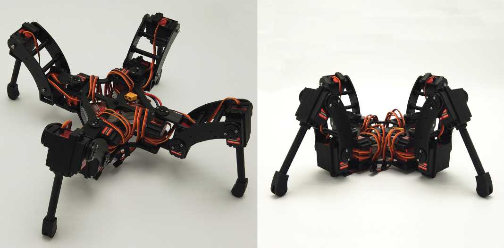

# NodeQuad V1
Quadruped project using NodeMCU-32S and MicroPython.   

## Brief introduction

- This project is about a spider quadruped. The robot can perform multiple gait in **MOVE** mode, and can rotate and translate with 6DOF in **POSE** mode.   
- Both **Remote control** and **Calibration** are done via `Wi-Fi` on `ESP32`.
- Brian: NodeMCU-32S (ESP32).    
- Actuator: 12 × 20Kg servo.   
- Power supply: 3S 2200mAh Lipo battery. mini360 DC-DC bulk for powering ESP32, PCA9685 and MPU6050. 8A UBEC for 12 servos. Check the PCB file for details.     
- The body is 3D printed PLA.   

## Assembly
### Fastener
Name | Spec | Required | Note
---- | ---- | --------- | -------- |
Screw | M2 * 6mm | 48 | Servo Steer : 4 x 12
Screw | M2 * 45mm | 8 | Body Base & Body Top: 2 x 4
Screw | M2.5 * 8mm | 48 | Servo Mounting: 4 x 12
Screw | M2.5 * 20mm | 8 | Tiabia Rod: 4 x 2
Screw | M3 * 65mm | 8 | Femur: 2 x 4
Screw | M3 * 10mm | 4 | Tip: 1 x 4
Screw | M3 * 12mm | 12 | Joint Axis: 1 x 12
Nuts | M2 | 8 | Body Base & Body Top: 2 x 4
Nuts (self-locking) | M3 | 12 | Joint Axis: 1 x 12 
Bearing | 684ZZ | 4 | Coxa: 1 x 4    
Bearing | 624ZZ | 8 | Femur & Tiabia: 4 + 4   

## Web Controller

## Demonstration (Video)
[Bilibili: 【四足机器人】贴心！真香警告：18舵机的树莓派六足机器人太贵，UP主连肝数日设计制作12个舵机的ESP32四足机器人NodeQuad](https://www.bilibili.com/video/BV1RL4y1M7Cu)   
[YouTube: Open Source 3D-printed Spider Quadruped robot using ESP32 and MicroPython](https://www.youtube.com/watch?v=OmWLzTs7Svc)   

## Others   

- 若有朋友需要3D打印结构件或其他相关配件，可以猛击[**淘宝链接**](https://item.taobao.com/item.htm?spm=a230r.1.14.6.2ea92ccdscMUVQ&id=668514867195&ns=1&abbucket=3#detail)。   
- 业余时间捣鼓开源项目不易，望大家多多Star以支持！   
