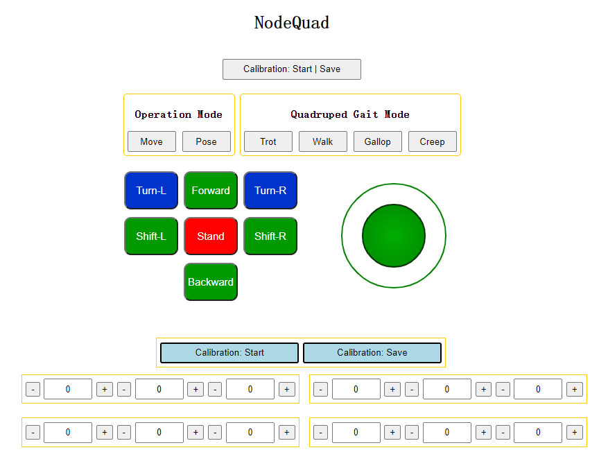

# NodeQuad V1
Quadruped project using NodeMCU-32S and MicroPython.   

## Brief introduction

## Demonstration (Video)
[Bilibili: 【四足机器人】贴心！真香警告：18舵机的树莓派六足机器人太贵，UP主连肝数日设计制作12个舵机的ESP32四足机器人NodeQuad](https://www.bilibili.com/video/BV1RL4y1M7Cu)